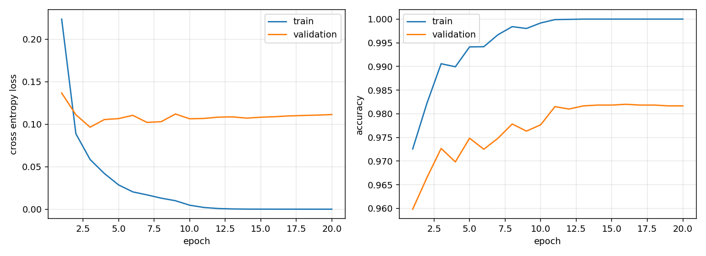
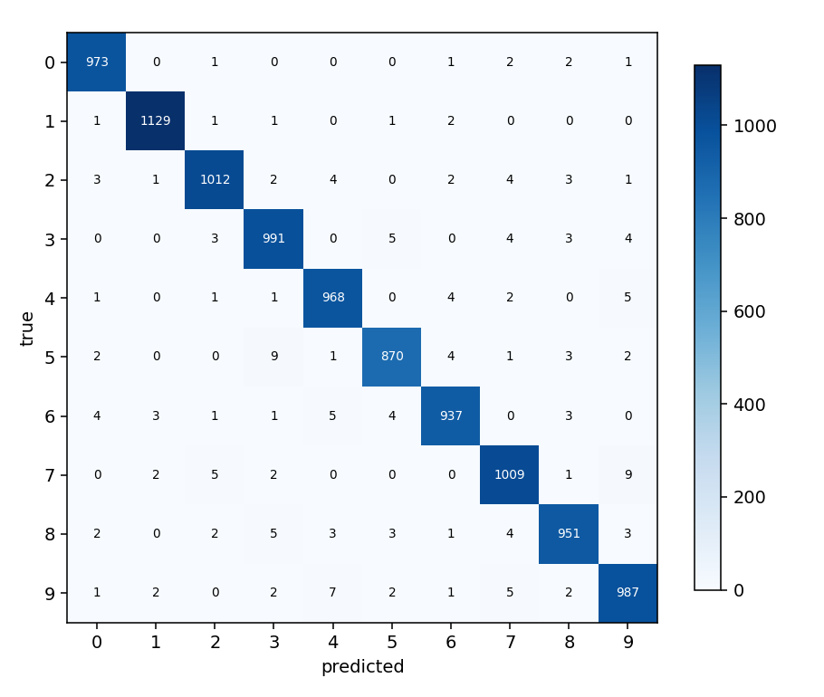

# ann-mnist

An artificial neural network for MNIST, written twice. Once in NumPy with
every derivative worked out by hand, and once in PyTorch. The NumPy version
is there to show what the framework does; the PyTorch version is there
because that is what you use afterwards.

The [guide](docs/README.md) is thirteen chapters covering the theory, from
the single perceptron through backpropagation to optimizers and
regularization. Every claim in it is checked against a run in this
repository.

Test accuracy: 0.9827 with NumPy, 0.9832 with PyTorch. Same architecture,
same data, same seed.



## Quickstart

```bash
git clone <this repo>
cd ann-mnist
pip install -r requirements.txt

python download_data.py          # 11 MB into data/raw
python train_scratch.py          # NumPy, about 15 s on CPU
python -m pytest -q              # 43 tests, including gradient checks
```

For the PyTorch half:

```bash
pip install -r requirements-torch.txt
python train_torch.py
```

## Workflow

```bash
# 1. get the data
python download_data.py

# 2. train the from scratch model
python train_scratch.py
python train_scratch.py --hidden 512 256 --optimizer adam --lr 0.001 --epochs 30

# 3. train the PyTorch model
python train_torch.py --dropout 0.2 --lr-decay 0.95

# 4. score a saved model, write the confusion matrix
python evaluate.py --model models/scratch_mlp.npz

# 5. reproduce the tables in the guide
python experiments.py --study activation
python experiments.py --study all --epochs 5

# 6. run it on your own handwriting
python predict.py --model models/scratch_mlp.npz --images my_digits --invert

# 7. check that backpropagation is right
python -m pytest tests/test_gradcheck.py -v
```

## Structure

```
ann-mnist/
├── data/                     MNIST, downloaded, not in git
│   └── raw/                  the four idx.gz files
├── docs/                     the guide, 13 chapters
│   └── figures/              plots the guide refers to
├── models/                   saved weights, not in git
├── notebooks/                scratch space
├── out/                      metrics and figures from each run
├── src/
│   ├── config.py             paths, defaults, TrainConfig
│   ├── data.py               IDX parser, scaling, splits, batching
│   ├── metrics.py            accuracy, confusion matrix, precision/recall/F1
│   ├── plots.py              learning curves, heatmap, error grid, filters
│   ├── seeds.py              reproducibility
│   ├── scratch/              NumPy implementation, no autograd
│   │   ├── activations.py    ReLU, leaky ReLU, sigmoid, tanh, softmax
│   │   ├── initializers.py   zeros, normal, Xavier, He
│   │   ├── layers.py         Linear, Dropout, forward and backward
│   │   ├── losses.py         softmax cross entropy fused, MSE, L2
│   │   ├── optimizers.py     SGD, momentum, Nesterov, RMSProp, Adam
│   │   ├── network.py        the MLP and the training loop
│   │   └── gradcheck.py      finite difference verification
│   └── torchmlp/             PyTorch implementation
│       ├── dataset.py        the same IDX files, as DataLoaders
│       ├── model.py          nn.Sequential, matched initialization
│       └── engine.py         train, evaluate, checkpoint
├── tests/                    43 tests
├── download_data.py
├── train_scratch.py
├── train_torch.py
├── evaluate.py
├── predict.py
└── experiments.py            the ablations behind the guide's tables
```

## Results

Twenty epochs, `784 -> 256 -> 128 -> 10`, ReLU, He initialization, SGD with
momentum 0.9, learning rate 0.05, batch 128, seed 0, CPU.

| | NumPy | PyTorch |
|---|---|---|
| test accuracy | 0.9827 | 0.9832 |
| test loss | 0.0918 | 0.0908 |
| macro F1 | 0.9825 | 0.9830 |
| parameters | 235,146 | 235,146 |
| training time | 15.5 s | 24.8 s |

The two agree to within run to run noise, which is the point: the hand
written backward pass is correct. PyTorch is slower on a model this small
because its per operation overhead outweighs what it saves. That reverses on
a GPU or with convolutions.

Per class, from the NumPy run:

| class | precision | recall | F1 | support |
|---|---|---|---|---|
| 0 | 0.9858 | 0.9929 | 0.9893 | 980 |
| 1 | 0.9930 | 0.9947 | 0.9938 | 1135 |
| 2 | 0.9864 | 0.9806 | 0.9835 | 1032 |
| 3 | 0.9773 | 0.9812 | 0.9792 | 1010 |
| 4 | 0.9798 | 0.9857 | 0.9827 | 982 |
| 5 | 0.9831 | 0.9753 | 0.9792 | 892 |
| 6 | 0.9842 | 0.9781 | 0.9812 | 958 |
| 7 | 0.9787 | 0.9815 | 0.9801 | 1028 |
| 8 | 0.9824 | 0.9764 | 0.9794 | 974 |
| 9 | 0.9753 | 0.9782 | 0.9767 | 1009 |

The most frequent mistakes are 7 read as 9, 5 read as 3, and 9 read as 4.
Those are the pairs that overlap in handwriting, which suggests the model
learned something about shape rather than about pixel positions.



## Ablations

Five epochs on a 20000 sample subset, run with `python experiments.py`.
Short runs, so read the large gaps and ignore the small ones.

| activation | val acc | | initialization | val acc |
|---|---|---|---|---|
| relu | 0.9605 | | zeros | 0.1092 |
| tanh | 0.9622 | | normal 0.01 | 0.9583 |
| leaky_relu | 0.9628 | | xavier | 0.9652 |
| sigmoid | 0.9385 | | he | 0.9605 |

| optimizer | val acc | | depth | val acc |
|---|---|---|---|---|
| sgd | 0.9413 | | 0 hidden (linear) | 0.8588 |
| sgd + momentum | 0.9605 | | 1 hidden | 0.9582 |
| nesterov | 0.9512 | | 2 hidden | 0.9605 |
| rmsprop | 0.9447 | | 3 hidden | 0.9613 |
| adam | 0.9617 | | | |

Two rows are worth reading closely. Zero initialization gives 0.1092
accuracy and loss 2.3031, which is $\log 10$: every unit stays identical to
every other and nothing is learned. And the linear model at 0.8588 against
0.9582 for one hidden layer is the whole argument for hidden layers, in one
comparison.

## The guide

| # | Chapter |
|---|---|
| 01 | [What a neural network is](docs/01-what-is-a-neural-network.md) |
| 02 | [The perceptron](docs/02-the-perceptron.md) |
| 03 | [Structure and the forward pass](docs/03-structure-and-forward-pass.md) |
| 04 | [Activation functions](docs/04-activation-functions.md) |
| 05 | [Loss functions](docs/05-loss-functions.md) |
| 06 | [Backpropagation](docs/06-backpropagation.md) |
| 07 | [Initialization](docs/07-initialization.md) |
| 08 | [Optimizers](docs/08-optimizers.md) |
| 09 | [Regularization](docs/09-regularization.md) |
| 10 | [The training loop](docs/10-training-loop.md) |
| 11 | [Evaluation](docs/11-evaluation.md) |
| 12 | [From NumPy to PyTorch](docs/12-numpy-to-pytorch.md) |
| 13 | [What comes after the MLP](docs/13-what-comes-next.md) |

Plus a [glossary](docs/glossary.md) in English and Vietnamese, and
[references](docs/references.md).

## Notes

MNIST is 60000 training and 10000 test images of handwritten digits, 28 by
28 pixels, grayscale, from LeCun, Cortes and Burges. `download_data.py` tries
several mirrors. The IDX format is parsed in `src/data.py` rather than
through a dataset library, so both implementations read the same bytes.

The validation split is 10 percent of the training set, taken with a fixed
seed. The test set is used once, at the end of a run, and never for choosing
hyperparameters.

Requirements: Python 3.10 or later, NumPy and matplotlib. PyTorch only for
`train_torch.py`.

## License

MIT. See [LICENSE](LICENSE).
